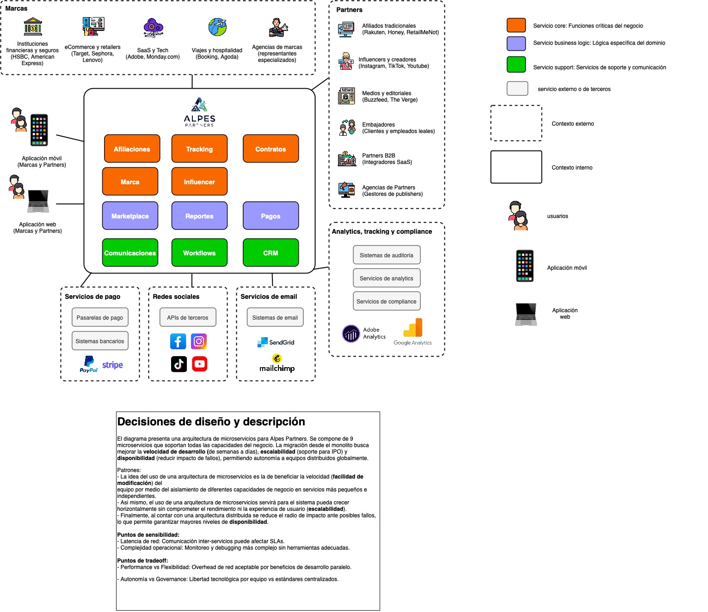
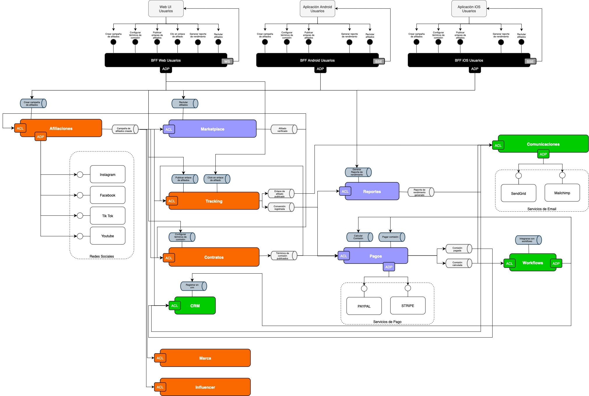
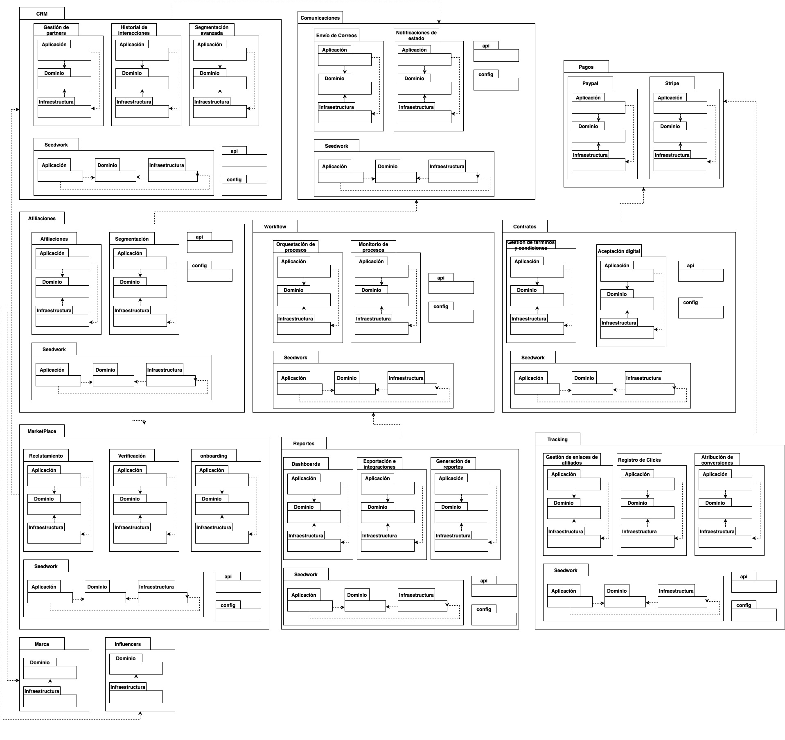

# Refinamiento de Diagramas de Arquitectura

## Descripción

Este documento presenta el refinamiento de los diagramas de los diferentes puntos de vista presentados en la segunda entrega, con base a los resultados y conclusiones de la experimentación.

## Cambios Realizados

### Principales Refinamientos

1. **Cambio de nomenclatura del servicio principal:**

   - Se cambió el nombre del servicio de "Campañas" por "Afiliaciones" para mejor reflejar el dominio de negocio y la funcionalidad específica del microservicio.

2. **Adición de nuevos servicios:**
   - Se añadieron los servicios de **Marca** e **Influencers** como microservicios independientes en la arquitectura.
   - Estos servicios complementan la funcionalidad del sistema de afiliaciones, proporcionando gestión específica para marcas e influencers.

## Diagramas Refinados

A continuación se presentan los tres diagramas actualizados con los cambios específicos realizados:

### 1. Diagrama de Contexto



> **Nota:** Si las imágenes no se muestran, puedes encontrarlas en la carpeta `arquitectura/`:
>
> - `diagramas-Contexto.jpg`
> - `diagramas-Funcional.jpg`
> - `diagramas-modulo.jpg`

**Cambios específicos en el diagrama de contexto:**

- ✅ **Renombramiento del servicio principal:** "Campañas" → "Afiliaciones"
- ✅ **Adición de nuevos actores:** Servicios de Marca e Influencers como entidades independientes
- ✅ **Actualización de las interacciones:** Nuevas relaciones entre Afiliaciones, Marca e Influencers
- ✅ **Refinamiento del contexto de negocio:** Mejor representación del ecosistema de afiliaciones

### 2. Diagrama Funcional



**Cambios específicos en el diagrama funcional:**

- ✅ **Separación de responsabilidades:** División clara entre gestión de afiliaciones, marcas e influencers
- ✅ **Nuevas funcionalidades:** Procesos específicos para cada microservicio
- ✅ **Flujos de comunicación:** Actualización de los flujos entre los servicios refinados
- ✅ **Arquitectura de eventos:** Implementación de patrones de comunicación asíncrona

### 3. Diagrama de Módulos



**Cambios específicos en el diagrama de módulos:**

- ✅ **Estructura modular actualizada:** Cada servicio (Afiliaciones, Marca, Influencers) con su propia estructura
- ✅ **Nuevos componentes:** Módulos específicos para gestión de marcas e influencers
- ✅ **Dependencias refinadas:** Actualización de las dependencias entre módulos
- ✅ **Separación de capas:** Dominio, aplicación e infraestructura para cada microservicio

## Acceso a los Diagramas

Si las imágenes no se muestran correctamente en tu visor de Markdown, puedes acceder a los diagramas directamente:

### Ubicación de los archivos:

```
📁 arquitectura/
├── 📄 diagramas-Contexto.jpg    (Diagrama de contexto del sistema)
├── 📄 diagramas-Funcional.jpg   (Diagrama funcional de la arquitectura)
└── 📄 diagramas-modulo.jpg      (Diagrama de módulos y componentes)
```

### Rutas alternativas:

- **Ruta relativa:** `./arquitectura/diagramas-Contexto.jpg`
- **Ruta absoluta:** `/arquitectura/diagramas-Contexto.jpg`
- **Desde la raíz del proyecto:** `arquitectura/diagramas-Contexto.jpg`

## Resumen de Cambios por Diagrama

| Diagrama      | Cambio Principal                                                                  | Impacto                                        |
| ------------- | --------------------------------------------------------------------------------- | ---------------------------------------------- |
| **Contexto**  | Renombramiento "Campañas" → "Afiliaciones" + Nuevos servicios Marca e Influencers | Mejor representación del dominio de negocio    |
| **Funcional** | Separación de responsabilidades en microservicios independientes                  | Arquitectura más granular y escalable          |
| **Módulos**   | Estructura modular completa para cada servicio                                    | Mejor organización del código y mantenibilidad |

## Justificación de los Cambios

Los refinamientos realizados se basan en:

1. **Resultados de la experimentación:** La implementación y pruebas del sistema revelaron la necesidad de separar las responsabilidades en servicios más específicos.

2. **Mejora en la claridad del dominio:** El cambio de "Campañas" a "Afiliaciones" proporciona mayor claridad sobre el propósito específico del servicio principal.

3. **Arquitectura más granular:** La adición de los servicios de Marca e Influencers permite una mejor separación de responsabilidades y escalabilidad del sistema.

4. **Alineación con el dominio de negocio:** Los cambios reflejan mejor la realidad del negocio de afiliaciones y marketing de influencers.

## Estructura Final de la Arquitectura

La arquitectura refinada incluye los siguientes microservicios:

### Microservicios Principales

| Servicio            | Estado       | Descripción                       | Cambio                      |
| ------------------- | ------------ | --------------------------------- | --------------------------- |
| **🏢 Afiliaciones** | ✅ Refinado  | Gestión de campañas de afiliación | Renombrado desde "Campañas" |
| **🏷️ Marca**        | 🆕 Nuevo     | Gestión de marcas y productos     | Agregado en refinamiento    |
| **👥 Influencers**  | 🆕 Nuevo     | Gestión de influencers y perfiles | Agregado en refinamiento    |
| **📊 Tracking**     | ✅ Existente | Seguimiento y métricas            | Sin cambios                 |
| **🌐 BFF**          | ✅ Existente | Backend for Frontend              | Sin cambios                 |

### Características de la Arquitectura Refinada

- ✅ **Independencia de servicios:** Cada microservicio mantiene su propia base de datos y lógica de negocio
- ✅ **Comunicación asíncrona:** Eventos y mensajería para la comunicación entre servicios
- ✅ **APIs bien definidas:** Interfaces claras para la integración entre servicios
- ✅ **Escalabilidad:** Cada servicio puede escalarse independientemente según la demanda
- ✅ **Mantenibilidad:** Separación clara de responsabilidades facilita el mantenimiento

### Flujo de Comunicación

```
BFF ↔ Afiliaciones ↔ Marca
  ↕        ↕         ↕
Tracking  Influencers
```

Cada servicio se comunica a través de eventos y APIs REST, siguiendo los principios de arquitectura de microservicios y Domain-Driven Design.
