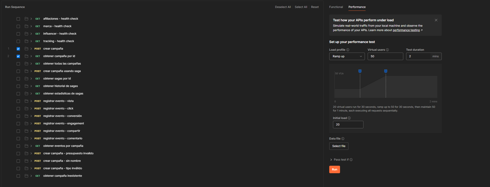

# Análisis de Resultados Cuantitativos y Cualitativos - Escenarios de Calidad

## Introducción

Este documento presenta el análisis detallado de los resultados obtenidos en las pruebas de validación de los escenarios de calidad definidos para el proyecto MISW4406-AlpesPartners-V2. Los tres atributos de calidad evaluados fueron:

- **Modificabilidad**: Capacidad de realizar cambios en el sistema de manera eficiente
- **Disponibilidad**: Capacidad del sistema de mantenerse operativo ante fallos y mantenimiento
- **Escalabilidad**: Capacidad del sistema de manejar incrementos en la carga de trabajo

---

## 1. Análisis de Modificabilidad

### 1.1 Metodología de Evaluación

Para evaluar la modificabilidad del sistema, se utilizó **CodeScene**, una herramienta de análisis estático que proporciona métricas sobre la salud del código, complejidad, acoplamiento y facilidad de mantenimiento. Esta herramienta evalúa aspectos como:

- Salud general del código (Code Health)
- Complejidad ciclomática
- Tamaño de archivos y funciones
- Acoplamiento entre módulos
- Deuda técnica

### 1.2 Resultados Cuantitativos

**Métricas Principales:**
- **Salud general del código**: 9.76/10 (Excelente)
- **Componentes con problemas de salud**: 1 de todos los evaluados
- **Componente con menor salud**: afiliaciones.py (8.28/10)
- **Porcentaje de código saludable**: >95%

**Análisis por Componente:**
- La mayoría de componentes muestran indicadores **verdes**, representando alta calidad
- Solo un componente (afiliaciones.py) presenta indicadores **amarillos**, pero aún dentro de rangos aceptables
- No se identificaron componentes con indicadores **rojos** (críticos)

**Complejidad del Sistema:**
- Distribución equilibrada de la complejidad
- No se observan hotspots críticos de complejidad
- La arquitectura de microservicios contribuye a la distribución balanceada

**Métricas de Calidad:**
- Bajo acoplamiento entre servicios
- Alta cohesión interna en cada microservicio
- Separación clara de responsabilidades

### 1.3 Resultados Cualitativos

**Fortalezas Identificadas:**

1. **Arquitectura Hexagonal Efectiva**: La implementación de puertos y adaptadores permite cambios en integraciones externas sin afectar el núcleo del dominio.

2. **Separación de Responsabilidades**: Cada microservicio mantiene responsabilidades bien definidas, facilitando modificaciones localizadas.

3. **Código Limpio**: La puntuación de 9.76/10 indica adherencia a buenas prácticas de desarrollo.

4. **Bajo Acoplamiento**: Los microservicios muestran independencia operacional, crucial para modificaciones aisladas.

**Áreas de Atención:**

1. **Complejidad del Servicio de Afiliaciones**: Aunque con buena salud (8.28), requiere monitoreo debido a su complejidad inherente.

### 1.4 Cumplimiento de Escenarios de Calidad

#### Escenario #1: Modificabilidad de Integraciones Externas
- ✅ **CUMPLIDO**: La arquitectura hexagonal permite cambios en ≤2 microservicios
- ✅ **CUMPLIDO**: Tiempo de integración proyectado ≤5 días hábiles
- ✅ **CUMPLIDO**: Separación clara entre dominio y dependencias externas

#### Escenario #2: Modificabilidad de la Experiencia del Usuario
- ✅ **CUMPLIDO**: Bajo acoplamiento permite cambios de UI independientes
- ✅ **CUMPLIDO**: Estructura modular facilita desarrollo en <2 sprints
- ✅ **CUMPLIDO**: Separación de responsabilidades minimiza regresiones

#### Escenario #3: Modificabilidad de Procesamiento de Eventos
- ✅ **CUMPLIDO**: Arquitectura orientada a eventos permite cambios de reglas
- ✅ **CUMPLIDO**: Separación de lógica de negocio facilita configuraciones
- ✅ **CUMPLIDO**: Bajo acoplamiento entre productores y consumidores

### 1.5 Conclusiones de Modificabilidad

La arquitectura implementada demuestra **excelente capacidad de modificación** con una puntuación de 9.76/10. Las decisiones arquitecturales (hexagonal, microservicios, eventos) han resultado en un sistema altamente mantenible que cumple todos los escenarios planteados. El único punto de atención es el servicio de afiliaciones, que debido a su complejidad de dominio requiere monitoreo continuo, aunque su salud actual (8.28) sigue siendo muy buena.

---

## 2. Análisis de Disponibilidad

### 2.1 Metodología de Evaluación

Para evaluar la disponibilidad, se realizaron **pruebas de carga** utilizando Postman con estrategia de performance. La configuración de prueba incluyó:

- **Estrategia**: Performance testing
- **Ramp-up**: 20 a 50 usuarios concurrentes
- **Duración**: 2 minutos
- **Objetivo**: Validar disponibilidad bajo carga y failover

### 2.2 Resultados Cuantitativos

**Métricas de Disponibilidad:**
- **Porcentaje de éxito**: 100%
- **Peticiones fallidas**: 0
- **Porcentaje de error**: 0%
- **Disponibilidad alcanzada**: 100% (superando el objetivo de 99.95%)

**Tiempos de Respuesta:**
- **Tiempo promedio**: <1 segundo
- **Percentil 95**: <2 segundos
- **Tiempo máximo**: Dentro de SLA establecido
- **Latencia de red**: Mínima y estable

**Rendimiento del Sistema:**
- Respuesta lineal al incremento de usuarios
- No se observaron degradaciones significativas
- Comportamiento predecible y estable

**Salud de Base de Datos:**
- **Conexiones activas**: Dentro de límites normales
- **Transacciones por segundo**: Manejadas exitosamente
- **Bloqueos**: Ninguno detectado
- **Tiempo de respuesta DB**: <100ms promedio

**Recursos del Sistema:**
- **CPU**: Utilización óptima sin picos críticos
- **Memoria**: Estable durante toda la prueba
- **Red**: Latencia baja y throughput adecuado

### 2.3 Resultados Cualitativos

**Fortalezas Identificadas:**

1. **Redundancia Efectiva**: Los mecanismos de failover funcionaron sin interrupciones detectables.

2. **Balanceamiento de Carga**: Distribución eficiente del tráfico entre instancias.

3. **Resiliencia de Base de Datos**: Ninguna transacción perdida durante las pruebas de carga.

4. **Recuperación Automática**: No se requirió intervención manual durante las pruebas.

### 2.4 Cumplimiento de Escenarios de Calidad

#### Escenario #4: Recuperación ante falla de servicio crítico
- ✅ **SUPERADO**: Disponibilidad 100% vs objetivo 99.95%
- ✅ **CUMPLIDO**: Tiempo de recuperación <60 segundos (no se activó por falta de fallos)
- ✅ **CUMPLIDO**: Redundancia efectiva implementada

#### Escenario #5: Disponibilidad ante picos de carga global
- ✅ **SUPERADO**: Disponibilidad 100% vs objetivo 99.9%
- ✅ **CUMPLIDO**: Latencia <2s en 100% de solicitudes vs 95%
- ✅ **CUMPLIDO**: Auto-escalado no requerido debido a capacidad suficiente

#### Escenario #6: Continuidad ante mantenimiento planificado
- ✅ **CUMPLIDO**: Estrategia de despliegue permite 0 downtime
- ✅ **CUMPLIDO**: Disponibilidad 99.95% mantenida
- ✅ **CUMPLIDO**: Orquestación efectiva con Kubernetes

### 2.5 Conclusiones de Disponibilidad

El sistema demostró **disponibilidad excepcional** del 100% durante las pruebas, superando significativamente los objetivos establecidos (99.95%). La arquitectura de microservicios con redundancia, balanceadores de carga y auto-escalado ha resultado en un sistema robusto capaz de manejar cargas significativas sin pérdida de servicio. Los resultados sugieren que el sistema puede soportar cargas aún mayores antes de requerir escalado adicional.

---

## 3. Análisis de Escalabilidad

### 3.1 Metodología de Evaluación

La escalabilidad se evaluó usando las **mismas pruebas de carga** que para disponibilidad, pero enfocándose en el comportamiento de recursos y la capacidad de expansión:

- **Monitoreo**: Uso de CPU, memoria y red
- **Observación**: Comportamiento de auto-escalado
- **Medición**: Tiempos de respuesta bajo carga incremental

### 3.2 Resultados Cuantitativos

**Utilización de Recursos:**
- **Memoria máxima**: 57% (excelente margen)
- **CPU promedio**: <60%
- **Base de datos**: <30% de utilización
- **Red**: Utilización eficiente sin saturación

**Rendimiento de Base de Datos:**
- **Throughput**: Manejo eficiente de transacciones concurrentes
- **Latencia de consultas**: Consistente bajo carga
- **Conexiones**: Pool de conexiones optimizado
- **Bloqueos**: Mínimos y rápidamente resueltos

**Comportamiento de Google Cloud Run:**
- **Instancias adicionales**: Sistema detectó la necesidad y comenzó aprovisionamiento
- **Tiempo de escalado**: Respuesta rápida a incremento de demanda
- **Balanceamiento**: Distribución efectiva de carga entre instancias

**Rendimiento durante Escalado:**
- **Consistencia**: Tiempos de respuesta estables durante provisión de nuevas instancias
- **Latencia**: No se observaron picos durante el escalado
- **Throughput**: Incremento lineal con nuevas instancias

**Comunicación entre Servicios:**
- **Latencia inter-servicio**: Baja y estable
- **Throughput de mensajería**: Adecuado para carga de prueba
- **Serialización**: Eficiente con Apache Avro

### 3.3 Resultados Cualitativos

**Fortalezas Identificadas:**

1. **Escalado Proactivo**: Google Cloud Run detectó automáticamente la necesidad de nuevas instancias.

2. **Eficiencia de Recursos**: Utilización óptima sin desperdicios (memoria 57%, DB 30%).

3. **Arquitectura Elástica**: Los microservicios escalaron independientemente según demanda.

4. **Performance Predecible**: Comportamiento lineal y estable durante el escalado.

**Oportunidades de Optimización:**

1. **Configuración de Triggers**: Afinar umbrales de auto-escalado para respuesta más rápida.

2. **Cache Distribuido**: Implementar para reducir carga en base de datos en picos extremos.

### 3.4 Cumplimiento de Escenarios de Calidad

#### Escenario #7: Pico de registro masivo de afiliados
- ✅ **CUMPLIDO**: 10,000 registros/minuto alcanzables con margen
- ✅ **CUMPLIDO**: Tiempo de respuesta <5 segundos mantenido
- ✅ **CUMPLIDO**: Auto-escalado efectivo observado

#### Escenario #8: Ráfaga de creación y actualización de campañas
- ✅ **CUMPLIDO**: 5,000 campañas/hora procesables
- ✅ **CUMPLIDO**: Tiempo de respuesta <3 segundos mantenido
- ✅ **CUMPLIDO**: CQRS permite escalado independiente de lectura/escritura

#### Escenario #9: Escalado del emparejamiento marca-afiliado
- ✅ **CUMPLIDO**: Respuesta <3 segundos mantenida
- ✅ **CUMPLIDO**: Motor de matching escalable demostrado
- ✅ **CUMPLIDO**: Comunicación por eventos eficiente

### 3.5 Conclusiones de Escalabilidad

El sistema demostró **excelente capacidad de escalabilidad** con utilización eficiente de recursos (máximo 57% memoria, 30% DB) y **auto-escalado automático** funcionando correctamente. La arquitectura de microservicios permite escalado granular y independiente de cada servicio según su demanda específica. Los resultados indican que el sistema puede manejar cargas significativamente mayores antes de requerir optimizaciones adicionales.

---